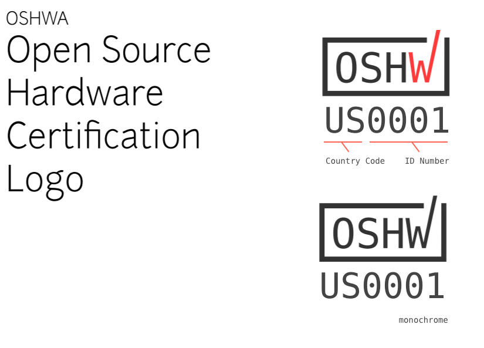
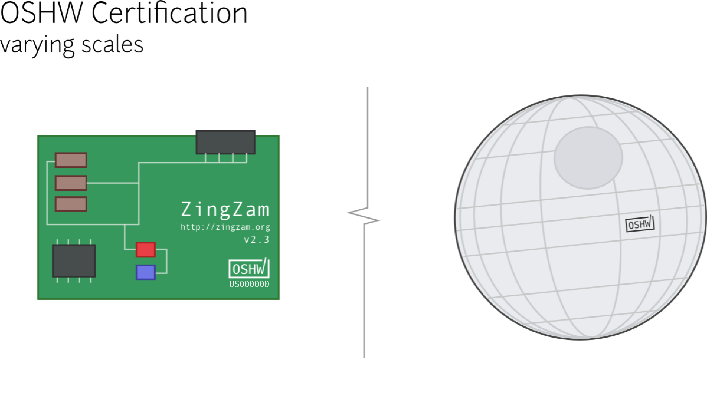
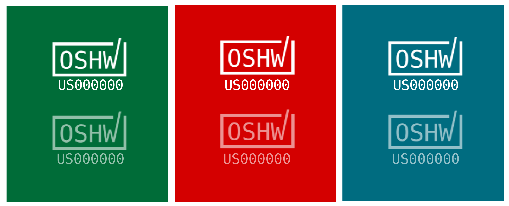

This repository contains artwork and usage guidelines for the graphic mark of the Open Source Hardware Self-Certification program hosted by OSHWA. The mark itself can be seen here:

When self-certifying, you may use the contained design files, provided in a range of file formats, to identify your work as certified Open Source Hardware, so long as you respect the terms of the certification program.

This repository is not for the text of the certification itself, nor (unfortunately), due to how trademark law underpins the certification program, can we accept changes to or allow derivative works of the mark itself. However, we are seeking submissions/pull requests which add new file formats to the collection (see below).

# Usage

The mark is designed to be used at a variety of sizes, as it may appear in extremely small sizes on circuit boards, or in larger sizes on open source hardware blimps and skyscrapers.

The mark uses two colors; a dark grey and a red with a slight orange/pink tint. The colors are shown here:

|      | grey | orange |
|------|------|--------|
| hex  | #333 | #F44   |
| hsv  |      |        |

However, many if not most printing will be monochrome, and the mark is also designed to be readable in a single color:

In addition, if displaying in text, you may represent the mark using square brackets: `[OSHW]` as you might see a copyright represented as `(c)`. The unique code can then be alongside, as in: `[OSHW] w35bir`.

# Formats

The "master" copy is in SVG, and we're starting with an initial list of commonly readable formats. The formats available now include:

- SVG
- PDF
- PNG

You can find these file formats in the `/templates/` folder of this repository.

We are accepting pull requests containing the mark in new file formats, and if you have a desired file format, please [open an issue to request it here](https://github.com/oshwa/certification-mark/issues/new).

# Attribution

The mark was based on ideas submitted by the OSHWA community in this blog post: http://www.oshwa.org/2016/03/17/open-hardware-certification-mark-call-for-ideas/, and primarily on the design submitted by Matt Maier. Thanks to everyone who provided input!

The typeface is Deja Vu Sans Mono, which is freely licensed at https://dejavu-fonts.org, and the mark was designed in Inkscape, free software available at https://inkscape.org.

For inspiration and to see what 'going overboard' means in the context of a style guide, see NASA's 1976 logo guidelines: https://www.nasa.gov/sites/default/files/atoms/files/nasa_graphics_manual_nhb_1430-2_jan_1976.pdf
